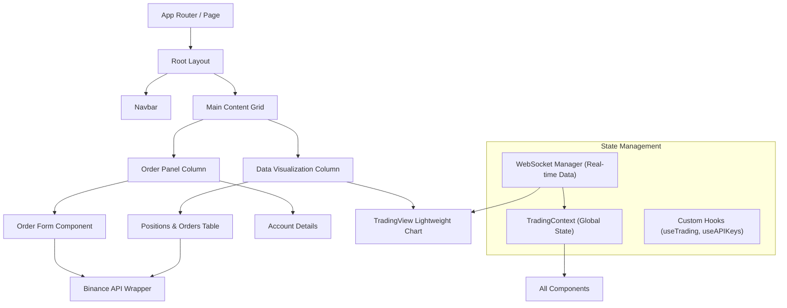

# Crypto Exchange

A real-time cryptocurrency trading interface built with Next.js, TypeScript, and Tailwind CSS. This application connects to the Binance Testnet API to simulate trading operations.

## Architecture Overview

The application follows a component-based architecture using the Next.js App Router.



### Key Components

*   **`TradingContext`**: Centralized state management for selected symbol, real-time price (`lastPrice`), and account information.
*   **`ChartComponent`**: Renders dynamic candlestick charts using `lightweight-charts`. It subscribes to WebSocket updates for real-time candle formation.
*   **`OrderPanel`**: A form for placing Limit, Market, and Stop Loss orders. It handles validation and API interaction.
*   **`PositionsTable`**: Displays real-time positions with PnL calculations, open orders, and trade history.

## Setup Instructions

1.  **Clone the repository:**
    ```bash
    git clone <repository_url>
    cd <project_directory>
    ```

2.  **Install dependencies:**
    ```bash
    npm install
    # or
    yarn install
    ```

3.  **Configure Environment Variables:**
    Create a `.env.local` file in the root directory. You can copy the following template:

    ```bash
    # Binance API Keys (Recommended for Testnet)
    NEXT_PUBLIC_BINANCE_API_KEY=your_testnet_api_key
    NEXT_PUBLIC_BINANCE_SECRET_KEY=your_testnet_secret_key

    # WebSocket Endpoint (Optional - defaults to Testnet)
    NEXT_PUBLIC_BINANCE_WS_URL=wss://testnet.binance.vision/ws
    ```

    > **Note:** For security, never commit your actual API keys to version control. The application is designed to work with Testnet keys for demonstration purposes.

4.  **Run the development server:**
    ```bash
    npm run dev
    ```

5.  **Open the application:**
    Navigate to [http://localhost:3000](http://localhost:3000) in your browser.

## API Integration Details

The application integrates with the Binance API (Testnet by default) for both REST and WebSocket data.

*   **REST API**: Used for placing orders (`/order`), fetching account balance (`/account`), and retrieving trade history (`/myTrades`). The requests are signed using HMAC-SHA256 as per Binance requirements in `src/lib/binance.ts`.
*   **WebSocket API**: A dedicated `WebSocketManager` (`src/lib/websocket.ts`) handles real-time subscriptions to trade streams (e.g., `btcusdt@trade`) and kline (candlestick) data.

### API Key Storage Strategy

For this frontend-only demonstration/assignment:
*   API keys can be provided via environment variables (`.env.local`) for convenience during development.
*   Alternatively, users can input keys directly in the application Settings (using `useAPIKeys` hook which persists to `localStorage`).
*   **Security Note:** In a production environment, API keys should **never** be stored on the client-side. All sensitive API calls (signing and execution) should be proxied through a secure backend server (e.g., Next.js API Routes or a separate Node.js service) to keep secrets safe.

## Trade-offs Made

*   **Client-Side Signing**: To keep the assignment strictly frontend-focused, request signing happens in the browser. This exposes the Secret Key if inspected. This is acceptable *only* for a testnet demo but strictly forbidden for production.
*   **Polling vs. Sockets**: Account data (balances, orders) is fetched via polling (every few seconds) to keep the implementation simple, whereas market data (prices) uses WebSockets for low latency. Ideally, User Data Streams (WebSockets) should be used for account updates too.
*   **Error Handling**: Basic error handling (toasts/alerts) is implemented. A more robust solution would handle specific Binance error codes (e.g., "Insufficient Balance") with tailored UI feedback.


## Bonus Features

*   **Limit order support**: Users can place Limit orders with specified prices.
*   **Stop market order support**: Added functionality for Stop Market orders.
*   **Dark/light theme toggle**: Fully integrated dark mode with `next-themes`.
*   **URL-based routing**: Dynamic routing (e.g., `/trade/BTCUSDT`) allowing deep linking to specific pairs.
*   **Virtualized tables**: Implemented `@tanstack/react-virtual` for high-performance rendering of large order/trade history lists.
*   **Skeleton loading states**: Added visual loading feedback.
*   **Error boundaries with retry logic**: Robust error handling for API failures.

## LLM-Generated Code Sections

The following sections were significantly refactored or generated with the assistance of an LLM:

*   **`src/components/Chart/ChartComponent.tsx`**: Refactored to fully type the Lightweight Charts integration and handle real-time WebSocket updates efficiently.
*   **`src/components/OrderPanel/OrderForm.tsx`**: Generated validation logic for Binance filters (LOT_SIZE, PRICE_FILTER) and strict TypeScript interfaces.
*   **`src/components/PositionsTable/PositionsTable.tsx`**: Implemented the PnL calculation logic and real-time updates, including the fix for `AbortController` signal handling.
*   **`src/lib/binance.ts` & `websocket.ts`**: Helper functions for HMCA-SHA256 signing and WebSocket connection management were adapted from standard documentation patterns.


## 🎥 Demo Video

Watch the full 2-minute demo showcasing real-time trading, charting, and order execution:

👉 https://www.youtube.com/watch?v=6KVHAmb0xaI
